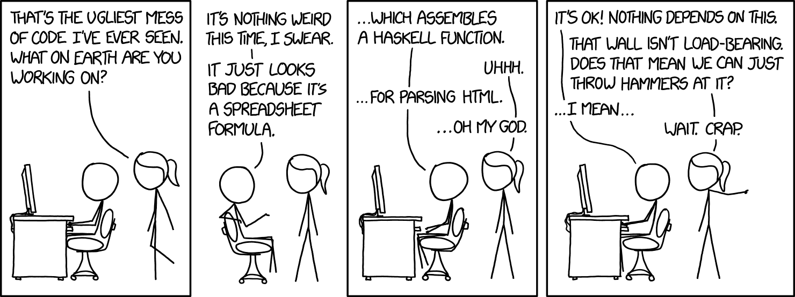

## The Importance of Clean Code

Consistency in language/syntax is one of the most important concepts you learn when you first learn a language for coding. I believe this idea of consistency ties in well with the concept of clean/readable code, or as our professor put it, the idea of "Coding Standards". Before this past week I had never heard of the tool ESLint, but I'm glad to have learned about it now at the beginning of my Javascript learning as I believe it is an invaluable tool for keeping your code up to "standard". The idea of keeping your code readable and maintainable is a concept that is heavily emphasized in CS courses in university and for good reason. There's a range of reasons why you should; one being so you yourself can read it when you come back to the code, but also so that others who will read your code can easily understand what you are trying to do. However, with ESLint this instills a notion of a wider "Coding Standard" to adhere to that can make everyone (or everyone who follows these standards) able to read this code even more easily.

## But There's Too Many Standards To Remember!

Our professor had directed us to the Airbnb Javascript style guide early in the course. I read through the whole page once and tried to absorb as much as I can, however it's not easy to recall all of these concepts as you are coding, unless you literally have the style guide open in another window as you are coding. This is another reason why I really like the tool ESLint. It allows to actually have something read and notify you about your code as you are writing it. In our exercise of fixing "Bad Javascript" it highlighted instantly what the coding standard violations were present in the code. This functionality is invaluable if you want to not only write clean code yourself, but to help others understand your code as well.

## The Benefit of Clean Code for the Future

If there's anything to take away from why the concept of "Coding Standards" is a great idea is that: The time you put into writing clean, readable, consistent code will save time for both yourself and others down the road. So why not use a tool like ESLint that will make this much easier for yourself? It is a worthwhile investment that will get you into the habit of writing good code, even if the code may only be for yourself, you will appreciate the extra effort you took to make the code even a tiny bit more clean and readable.

