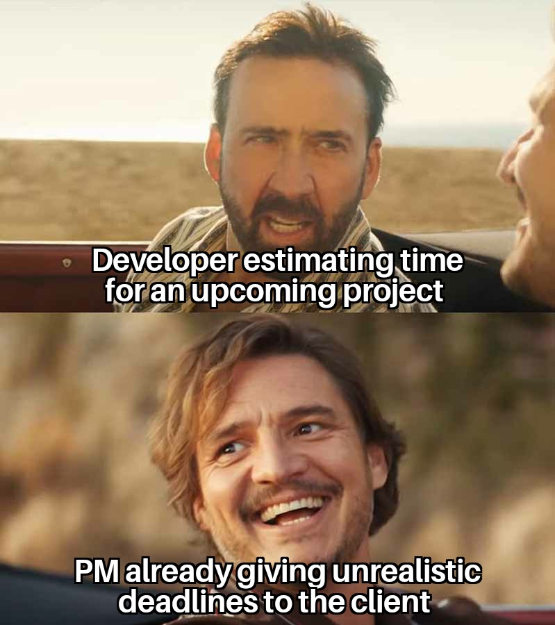

  

## Introduction

Over the development of our project : Musicians of Manoa, we kept a time tracking of how long we would estimate each issue to take to finish. After we finished the issue we would then record the actual time it took to finish each issue, this led to some insights on the productivity and how my estimations on how long an issue will take were alnmost always incorrect.

## Method of Estimation

For my method of estimation on how long an issue would take, there wasn't really a scientific methodology to my estimations besides gut feeling and how similar I found it to previous similar experiences we had. I think this hinges on how specific the issue is and contextualizing it with what you have done before. For example, one of the issues I worked on was "Create Landing Page". I estimated it to take 180 minutes, or 3 hours to complete. However, while the page was fairly straightforward to create, especially since the template files are already there, choosing the overall design and presentation of what the landing page should be takes a fair amount of time to think of. The landing page ending up taking me about 5 hours to complete, nearly double my intial estimate. The reason why is because I spent a fair amount of time figuring out the specific design I found visually appealing, choosing photos to convey what the app is about, and formatting it to an appealing presentation.

## Inaccuracy In Measurements

Looking back at the data, I would say generally my estimations were always off in that it always took longer than I would estimate. I wouldn't be terribly off in my estimates, but it would always be around 30 to 2 hours longer in terms of actual effort than I had initially estimated. I generally don't think there was a benefit to these inital estimates because thankfully the way our efforts were structured between teammates, we didn't need to generally rely on each other to complete sections such that another member could start working. For example, since I worked a lot on the landing page, this wouldn't affect the 'Search Jams' page at all. The isolation of efforts helped our team work smoothly.

I believe there were some benefits in seeing the actual effort expended on issues. One being that it gives you insight on your own personal estimations of your skill and alotted time to complete a problem. What I took away from this project is that I generally underestimated the time I took to finish a problem and should give myself more time for each issue I assign myself to in the future.

## Method of Actual Estimation

I tracked my time efforts through my phone timer or a computer timer. I would usually set a time to work for (eg. 90 minutes) this method helps me focus on a task and when to take a bit of a break so I don't end up staring at the screen and being unproductive for stretches of time. I believe this method was accurate and generally I found myself working for longer than expected on an issue. So I would time go into the session with maybe two sessions of 90 minutes each for a problem (so 3 hours overall), I would find that after those 3 hours I would generally be nearly done and need maybe just a half hour longer to clean everything up and make sure the work I did is actually compatible with the final project overall.
