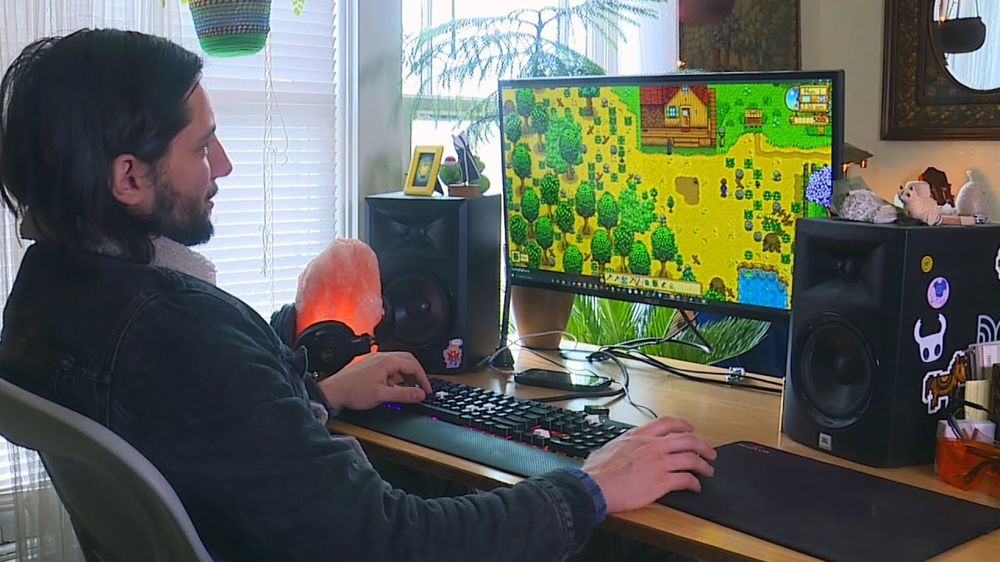

## Interest in Software Engineering and What I Hope To Come

My interest in software engineering began at a young age when I found myself captivated by computers, primarily drawn in by video games. I have always been fascinated by how these complex digital worlds are created, and this curiosity naturally led me to pursue a degree in computer science. The stories of solo developers who created successful games on their own, like the creator of Stardew Valley, have been a significant source of inspiration for me. I am particularly drawn to game development because it combines my passion for creativity and problem-solving. While I understand the challenges of the gaming industry, including its volatility and demanding nature, I am motivated by the idea that with the right skills and determination, one can turn a personal vision into a reality. My goal is to one day develop my own game, utilizing the skills I have gained throughout my education and personal projects.

However, my interests extend beyond game development. Growing up immersed in technology and the internet, I developed a curiosity about various areas of software engineering, from web development and cryptography to computer graphics and backend systems. I have always wanted to understand how things work on a deeper level and explore the diverse applications of computer science. My journey through university has provided me with the opportunity to experiment with different aspects of the field, helping me to develop a well-rounded skill set. This has opened my eyes to the potential of building applications beyond just games and has highlighted the importance of being adaptable and open-minded in the rapidly evolving field of technology. 

In the future, I hope to gain professional experience as a software developer to better understand how companies approach software development, particularly in collaborative and real-world settings. Working in a professional environment will allow me to refine my technical skills, learn industry best practices, and connect with like-minded individuals who share my passion for building creative and innovative software. I am excited by the prospect of meeting others who are interested in similar topics, as collaboration can lead to unique opportunities and new perspectives. Ultimately, I aspire to use the skills I acquire to develop software that reflects my creativity, whether it’s my own game or another project that sparks my interest. I am eager to continue learning, growing, and pushing the boundaries of what I can achieve in the field of software engineering.

