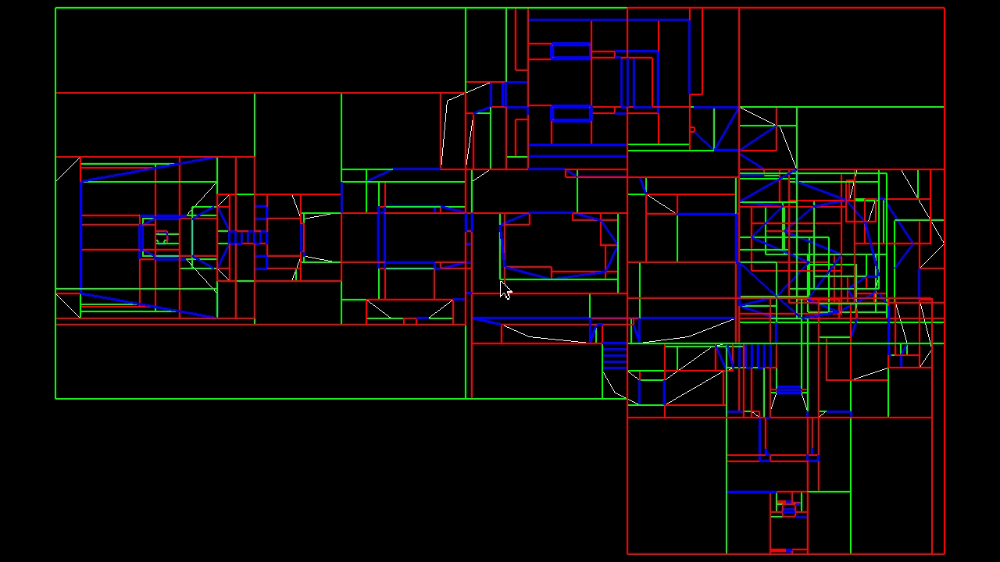

<em>Visualization of Doom's Binary Space Partitioning (BSP) tree structure used for rendering subsectors.</em>

## Overview

For my Algorithms class, I wrote a paper delving into the deeper workings of the engine utilized in id Software's game Doom (1993). The focus is on id Software’s pioneering role in pushing the technological boundaries of video game graphics, particularly within the first-person shooter genre. The analysis begins with Doom (1993), highlighting its use of Binary Space Partitioning (BSP) trees to optimize graphics rendering on the limited hardware of the time. Doom’s graphical innovation stemmed from the need to improve upon the costly ray-casting technique used in its predecessor, Wolfenstein 3D. By employing BSP trees, Doom efficiently managed hidden-surface determination, rendering only the visible parts of a game level to reduce the computational load on the CPU. This technique allowed Doom to achieve smoother and more immersive gameplay, setting a new standard for performance in video games. The transition from Doom to Quake (1996) marks an evolution from 2.5D to true 3D rendering, with Quake building upon the BSP tree structure by introducing Potential Visible Set (PVS) calculations.

Above is simple example of essentially how binary space partitioning was utilized with the map files in Doom. Think of the overall shape seen above as the top down 2D view of the map that is in the game. The sections of the map are divided into a tree structure, which helps determine which areas of the map need to be rendered depending on where the player character (you) are viewing. The BSP tree structure of the map is used to determine what parts of the map are visible from the player's current position and viewing angle. The game engine starts rendering from the player's position and moves forward through the tree, prioritizing visible surfaces in front of the player.

A link to the paper : [An Analysis of Game Development Evolution : From Doom (1993) to Quake (1996)](https://docs.google.com/document/d/1vllxXh5O_0GWxGrbAjIGfFCpPITA7LavtaLB3MWYlaI/edit?usp=sharing)
