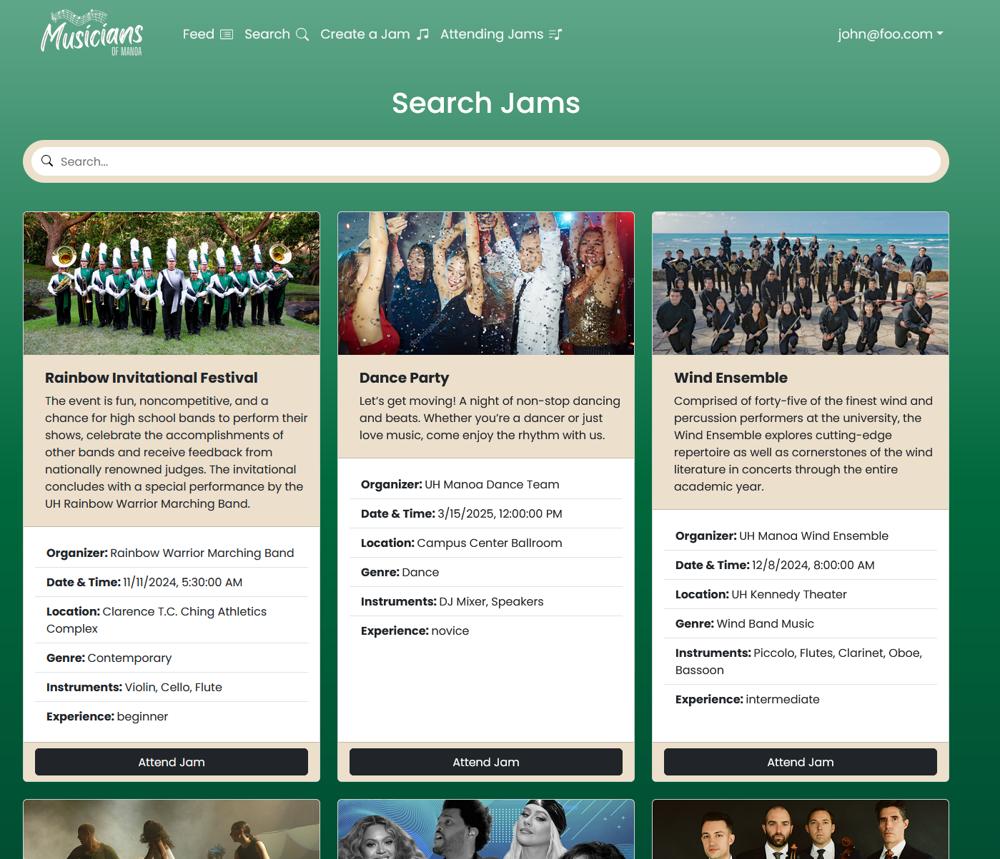

  

    
    
<em>The landing page of the 'Musicians of Manoa' web application.</em>

  

  

    
    
<em>The 'Search Jams' page displaying upcoming jam sessions.</em>

  

## Overview

The "Musicians of Manoa" project is a web application designed to help local musicians connect, collaborate, and find jam sessions. It provides a user-friendly interface featuring a dynamic feed of upcoming jams, a searchable database of musician profiles, and tools for creating new jam events. Through role-based access, admins can manage users and edit site content, while general users can explore and attend jams. The application leverages Next.js, React, Prisma, and PostgreSQL for a modern, performant experience. Ultimately, it aims to foster a vibrant community of musicians who can easily discover and engage with one another.

## My Contributions and What I Learned

In this project, I focused on refining both the front-end design and the underlying code to ensure a smooth and visually appealing user experience. This included implementing a global font, adjusting gradients and colors to align with the site’s theme, and generally adjusting the UI elements overall. I also worked on layout spacing, the catchphrase, images, and the buttons better aligned and visually balanced. On the back-end and testing side, I worked on fixing seed data and ensuring that pages such as the “Feed” and “Search” loaded correctly and met the project's requirements.

I learned a great deal from this project, particularly about building a full-stack application from the ground up. Gaining hands-on experience with React in a larger codebase showed me how to structure components effectively and maintain clear connections between the front end and the back end. Through trial and error, I also developed a better understanding of how the database interacts with the client-side elements. Additionally, collaborating with teammates on GitHub introduced me to the workflow and communication practices needed to handle larger projects successfully.

## Our Github Organization Page

[Musicians of Manoa](https://musicians-of-manoa.github.io/)
