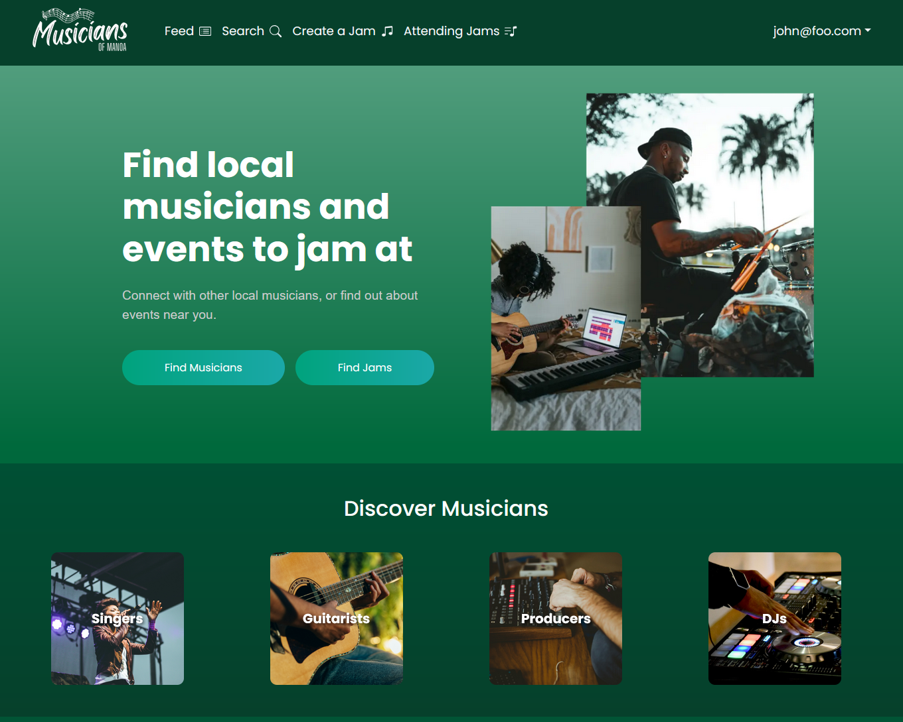

## Overview

The "Musicians of Manoa" project is a web application designed to help local musicians connect, collaborate, and find jam sessions. It provides a user-friendly interface featuring a dynamic feed of upcoming jams, a searchable database of musician profiles, and tools for creating new jam events. Through role-based access, admins can manage users and edit site content, while general users can explore and attend jams. The application leverages Next.js, React, Prisma, and PostgreSQL for a modern, performant experience. Ultimately, it aims to foster a vibrant community of musicians who can easily discover and engage with one another.

